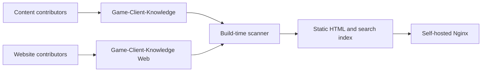
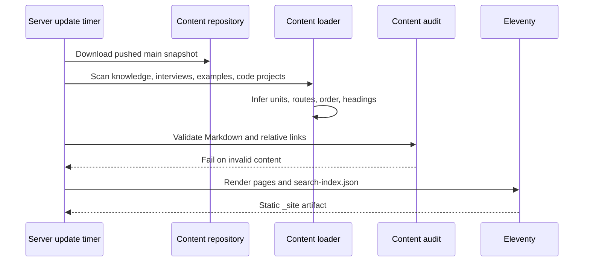

# System Architecture

## Goals

1. Keep knowledge storage independent from website implementation.
2. Discover new topics without editing a manifest or navigation configuration.
3. Render fundamentals, long interview transcripts, Mermaid diagrams, and source
   examples with one consistent reading model.
4. Produce static output that is inexpensive to host and safe to serve publicly.
5. Fail the build when content links, heading structure, or generated routes are
   invalid.

## Repository boundary



The content repository has no JavaScript dependencies or generated website files.
The website repository has no committed copy of knowledge content.

## Content model

Four stable roots define reader intent:

```text
knowledge/<topic>/
interviews/<company>/<event-or-position>/
examples/<domain>/<example>/
code/<domain>/<project>/
```

A directory containing `README.md` is a content unit. Its first H1 is the unit
title, and its first paragraph is the default description. Other Markdown files in
that directory are ordered by numeric filename prefix. Small source examples below
`examples/` become ordinary source pages. Complete projects below `code/` are
handled by the independent project processor and client-side IDE workspace.

No frontmatter is required. Optional `title`, `description`, and `order` values can
override inferred metadata for exceptional cases.

## Discovery pipeline



The scanner builds:

- Module metadata and counts.
- Content units from `README.md` directories.
- Document routes and source-to-route mappings.
- Previous and next navigation within each unit.
- H2 and H3 table-of-contents entries.
- Search records containing title, summary, unit, type, and full text.

Relative Markdown links are resolved against source paths and rewritten to generated
routes. Unknown existing files are served through the static `raw/` tree so images
and downloadable assets continue to work.

## Route rules

| Source | Generated route |
|---|---|
| `knowledge/cpp/README.md` | `/knowledge/cpp/` |
| `knowledge/cpp/01-cpp98.md` | `/knowledge/cpp/01-cpp98/` |
| `examples/algorithms/demo/main.cpp` | `/examples/algorithms/demo/files/main.cpp/` |
| `code/ecs/demo/code-project.json` | `/code/workspace/?project=demo` |

Routes use ASCII filenames for reliable hosting. Document display names remain
fully localized because they come from Markdown headings.

## Rendering

Eleventy 3 was selected because it:

- Runs on the same Node 20 release used locally and in CI.
- Generates complete static HTML without a runtime server.
- Allows an external directory to act as the content source.
- Keeps templates and scanner logic small enough to audit.

Markdown is rendered with `markdown-it`. Prism performs build-time syntax
highlighting, Mermaid renders diagrams in the browser, and Lucide supplies interface
icons. Raw HTML in contributed Markdown is disabled.

## Reading experience

Desktop document pages use three stable regions:

- Module and topic navigation on the left.
- A constrained long-form article column in the center.
- H2/H3 page outline on the right.

The outline is removed at narrower desktop sizes. The topic navigation becomes an
off-canvas drawer on mobile. Long tables scroll horizontally, code blocks preserve
their dimensions, and heading and filename text can wrap without changing control
sizes.

Search is loaded only when opened. The generated index uses weighted substring
matching across title, unit, description, and full text, which handles Chinese
queries without depending on whitespace tokenization.

Authenticated editing is layered on top of the static reader rather than replacing
it. The header calls the same-origin `/editor/api/` service for session state. Edit
mode uses each generated page's source metadata to load and save private Markdown
drafts. Toast UI Editor provides WYSIWYG interaction while keeping Markdown as the
storage and Git submission format. Saved drafts overlay the static reader in the
authenticated browser, while public rendered reading remains available without
authentication.
The separate `/editor/` workspace provides the complete repository tree, aggregate
change review, and the only branch/commit/pull-request submission action.

Reader authentication and draft state are loaded through one head-started bootstrap
request. Static content is never blocked by that request; account controls keep
stable loading dimensions until the response atomically applies identity and draft
overlays.

## Alternatives considered

### Docusaurus or VitePress

Both provide strong documentation defaults, but their normal content models keep
documents inside the website repository or require generated configuration and
sidebars. Adapting an external content repository would add framework-specific
metadata to the storage layer.

### Client-only React application

A single-page application would simplify dynamic routing, but it would delay content
rendering, weaken static link behavior, and require fallback routing on GitHub
Pages.

### Runtime GitHub API

Fetching repository contents in each browser would always show the latest commit,
but it would expose readers to API rate limits, create loading states for every
navigation action, and make full-text search expensive. Build-time synchronization
is more predictable.

## Tradeoffs

- Scheduled builds can trail content by up to one hour. Manual and
  `repository_dispatch` triggers provide immediate rebuilds when needed.
- The search index is downloaded as JSON when search first opens. This is efficient
  for the current repository and should be replaced with a segmented index only
  when measured payload size justifies it.
- Serving the source tree under `raw/` duplicates Markdown and code in the artifact,
  but preserves arbitrary relative assets without requiring contributors to learn
  an asset pipeline.
