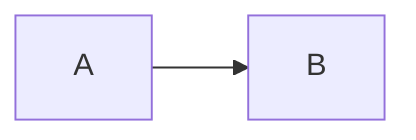

# Mermaid Rendering

## Execution Boundary

Published Mermaid diagrams are rendered during the static build. The build
reads a Markdown fence:

````markdown

````

and stores the generated SVG directly in the page:

```html
<div class="mermaid" data-mermaid-rendered="true">
  <svg>...</svg>
</div>
```

The production editor service and web server do not execute Mermaid. Rendering
runs once in a temporary local Chrome process during deployment. Production
only serves immutable HTML containing the SVG, so diagram loading adds no
runtime server work and no Mermaid package download.

## Build Cache

The previous implementation loaded Mermaid's complete UMD distribution as one
blocking `3.57 MB` file. An ESM code-splitting replacement reduced the entry to
about `30 KB`, but a production cold load required 28 module requests and about
`4.7 seconds` of runtime loading. Combining common diagrams into one file
removed the waterfall, but a Cloudflare cold miss then spent `20.7 seconds`
transferring the bundle through the tunnel.

`scripts/build-mermaid-cache.js` now:

1. scans the immutable content snapshot for Mermaid fences;
2. creates a cache key from source path, fence index, and normalized source;
3. renders every diagram with deterministic IDs in one headless browser;
4. writes `.cache/mermaid-rendered.json`;
5. lets the Eleventy Markdown renderer inject the matching SVG.

The generated cache is ignored by Git. Content and website repositories remain
separate, and every deployment rebuilds SVG from the selected pushed content
commit. `audit:site` fails if any generated page still contains unrendered
Mermaid source.

## Client Fallback

A small type-aware bootstrap remains for local watch mode, cache misses, and
dynamic editor output:

```text
assets/vendor/mermaid/mermaid-client.js
assets/vendor/mermaid/mermaid-common.js
assets/vendor/mermaid/fallback/mermaid-full.js
assets/vendor/mermaid/fallback/chunks/*.js
```

The bootstrap is approximately `1.1 KB`. Pre-rendered pages mark their state as
`prerendered` and do not request either runtime. Unrendered common syntax uses
the single-file common runtime for flowcharts, class diagrams, sequence
diagrams, state diagrams, and ER diagrams.

Less common syntax automatically selects the complete split ESM fallback.
Compatibility is preserved without putting those implementations on the
published reading path.

The selected fallback runtime initializes Mermaid with `startOnLoad: false` and
calls:

```javascript
mermaid.run({ nodes });
```

## Loading State

Diagram pages still receive the `mermaid-loading` HTML class for raw-source
fallbacks. CSS excludes `[data-mermaid-rendered]`, so build-generated SVG is
visible immediately and never shows a spinner or layout placeholder.

The bootstrap exposes diagnostics:

- `body[data-mermaid-state="ready"]` indicates success.
- `body[data-mermaid-runtime="prerendered"]` identifies static SVG.
- `body[data-mermaid-runtime="common"]` or `full` identifies a fallback.
- `body[data-mermaid-render-ms]` records fallback render duration.
- `body[data-mermaid-ready-ms]` records navigation-relative readiness.

If fallback parsing fails, the state becomes `error`, the loading class is
removed, and the original source remains readable.

## Verification

The build and browser suites verify:

- all 33 current Mermaid fences are pre-rendered;
- generated pages contain no unrendered Mermaid source;
- every SVG has a deterministic, page-unique ID;
- the published page requests only the sub-`10 KB` bootstrap;
- neither the common runtime nor fallback chunks are requested;
- browser console and page errors remain empty;
- desktop and mobile layout scenarios still pass.

The local production-build baseline for a page containing four diagrams is:

```text
Navigation to ready state:       602 ms
Generated SVG diagrams:          4
Mermaid runtime requests:        0
Mermaid bootstrap requests:      1
Bootstrap decoded size:          about 1.1 KB
```

These values include normal HTML and page-script loading. The SVG itself is
already present when the HTML response is parsed.
