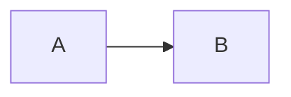

# Client Mermaid Rendering

## Execution Boundary

Mermaid diagrams are rendered entirely in the browser.

The static build performs only one transformation:

````markdown

````

becomes an escaped source container:

```html
<div class="mermaid">flowchart LR ...</div>
```

The editor service and production web server do not parse Mermaid syntax or
generate SVG. They only serve the static HTML and versioned JavaScript assets.

## Split Runtime

The previous implementation loaded Mermaid's complete UMD distribution as one
blocking `3.57 MB` file. It then enabled `startOnLoad`, so rendering waited for
the complete package and the browser load lifecycle.

The current build uses Mermaid's official ESM entry through esbuild code
splitting:

```text
assets/vendor/mermaid/mermaid-client.js
assets/vendor/mermaid/chunks/*.js
```

The entry is approximately `30 KB` before compression. Diagram implementations
remain dynamic imports. A page containing only `flowchart` syntax therefore
loads the shared Mermaid runtime and flowchart chunks, not implementations for
every supported diagram type.

Diagram pages add a `modulepreload` hint for the entry. The module initializes
Mermaid with `startOnLoad: false` and immediately calls:

```javascript
mermaid.run({ nodes });
```

This removes the second wait for the browser `load` event.

## Loading State

Diagram pages receive the `mermaid-loading` HTML class during static rendering.
The source remains in the DOM for parsing and fallback, but a fixed-height,
non-text loading indicator prevents raw syntax and layout movement from being
shown.

After rendering:

- `body[data-mermaid-state="ready"]` indicates success.
- `body[data-mermaid-render-ms]` records client render duration.
- `mermaid-loading` is removed and the generated SVG becomes visible.

If parsing fails, the state becomes `error`, the loading class is removed, and
the original source remains readable.

## Verification

The browser suite verifies:

- at least one Mermaid SVG is generated;
- the split ESM entry is below `100 KB` before compression;
- multiple Mermaid module resources are loaded on demand;
- the former `/assets/vendor/mermaid.min.js` bundle is not requested;
- local cold rendering completes in under `2.5 seconds`;
- browser console and page errors remain empty.

The implementation baseline measured on the local production build was:

```text
First isolated browser context: 556 ms to SVG
Subsequent isolated contexts:   163-165 ms to SVG
Mermaid render work:             60-63 ms
Requested Mermaid modules:       808 KB decoded
```

These numbers are diagnostics rather than a network-wide SLA, but they keep the
client implementation well below the previous multi-second cold-load path.
