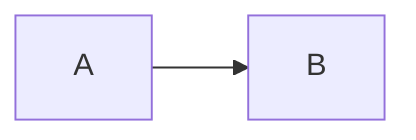

# Client Mermaid Rendering

## Execution Boundary

Mermaid diagrams are rendered entirely in the browser.

The static build performs only one transformation:

````markdown

````

becomes an escaped source container:

```html
<div class="mermaid">flowchart LR ...</div>
```

The editor service and production web server do not parse Mermaid syntax or
generate SVG. They only serve the static HTML and versioned JavaScript assets.

## Adaptive Runtime

The previous implementation loaded Mermaid's complete UMD distribution as one
blocking `3.57 MB` file. It then enabled `startOnLoad`, so rendering waited for
the complete package and the browser load lifecycle.

An initial ESM code-splitting implementation reduced the entry to about `30 KB`,
but a production cold load required 28 module requests. Cloudflare Tunnel
latency turned the dependency graph into another multi-second waterfall.

The current build uses a small type-aware bootstrap and two browser runtimes:

```text
assets/vendor/mermaid/mermaid-client.js
assets/vendor/mermaid/mermaid-common.js
assets/vendor/mermaid/fallback/mermaid-full.js
assets/vendor/mermaid/fallback/chunks/*.js
```

The bootstrap is approximately `1.1 KB`. It selects the single-file common
runtime for flowcharts, class diagrams, sequence diagrams, state diagrams, and
ER diagrams. This path covers all diagram types currently used by the content
repository and requires two parallel requests without a dynamic-import
waterfall.

Less common Mermaid syntax automatically selects the complete split ESM
fallback. Compatibility is preserved without adding those implementations to
the critical path of every diagram page.

Diagram pages add `modulepreload` hints for both the bootstrap and common
runtime. The bootstrap preserves the commit query string when importing the
runtime, preventing a preload/import URL mismatch and duplicate download. The
selected runtime initializes Mermaid with `startOnLoad: false` and immediately
calls:

```javascript
mermaid.run({ nodes });
```

This removes the second wait for the browser `load` event.

## Loading State

Diagram pages receive the `mermaid-loading` HTML class during static rendering.
The source remains in the DOM for parsing and fallback, but a fixed-height,
non-text loading indicator prevents raw syntax and layout movement from being
shown.

After rendering:

- `body[data-mermaid-state="ready"]` indicates success.
- `body[data-mermaid-runtime="common"]` or `full` identifies the selected path.
- `body[data-mermaid-render-ms]` records client render duration.
- `body[data-mermaid-ready-ms]` records navigation-relative SVG readiness.
- `mermaid-loading` is removed and the generated SVG becomes visible.

If parsing fails, the state becomes `error`, the loading class is removed, and
the original source remains readable.

## Verification

The browser suite verifies:

- at least one Mermaid SVG is generated;
- the bootstrap is below `10 KB`;
- the common runtime is below `1.5 MB` decoded;
- the common path uses exactly two Mermaid requests;
- common diagrams do not request fallback chunks;
- the former `/assets/vendor/mermaid.min.js` bundle is not requested;
- local cold rendering completes in under `2.5 seconds`;
- browser console and page errors remain empty.

The implementation baseline measured on the local production build was:

```text
Common bootstrap:                1.1 KB decoded
Common runtime:                  1.31 MB decoded / about 281 KB Brotli
Cold navigation to SVG:          982 ms
Cold runtime selection/render:   436 ms
Warm state/sequence rendering:   81-107 ms
Common Mermaid requests:         2
```

These numbers are diagnostics rather than a network-wide SLA, but they keep the
client implementation well below the previous multi-second cold-load path.
