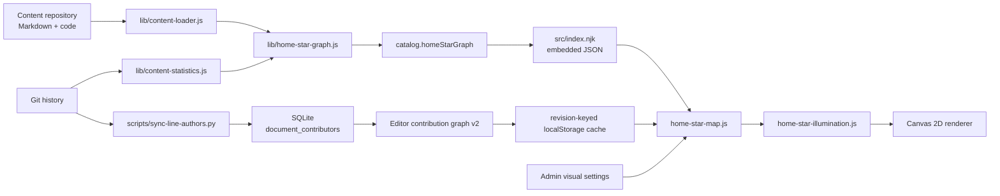

# Home Star Map Development Guide

## 1. Scope

This document is the engineering record for the homepage contribution star
map. It explains where the graph comes from, how it is transformed, how the
Canvas renderer consumes it, and how to modify the feature without breaking
revision consistency, contribution attribution, or production deployment.

For the user-facing behavior and formulas, see
[Homepage Contribution Star Map](./home-contribution-star-map.md).

The current implementation has four explicit layers:

1. build-time content graph generation;
2. revision-matched contribution data;
3. pure graph algorithms;
4. Canvas rendering and administration settings.

Keeping those layers separate is the main design constraint. Graph facts must
not depend on star positions, and visual pruning must not change graph
coverage.

## 2. End-to-End Data Flow



The static graph is always available and is the fallback. The server graph
only replaces contribution identities and contribution edges when its content
revision matches the embedded static revision.

## 3. Source Ownership

| File | Responsibility |
| --- | --- |
| `lib/content-loader.js` | Scans tracks, modules, topics, Markdown, and readable code routes. |
| `lib/content-statistics.js` | Caches Git history and derives contributor/file 7-day and 30-day metrics. |
| `lib/home-star-graph.js` | Converts catalog data into stable stars and typed relations. |
| `lib/star-formula-engine.js` | Parses and evaluates the browser formula AST and assigns brightness tiers. |
| `src/index.njk` | Embeds `catalog.homeStarGraph` into `window.GCK_HOME_STAR_GRAPH`. |
| `src/assets/js/home-star-illumination.js` | Pure adjacency, traversal, coverage, tree, path, and brightness presentation algorithms. |
| `src/assets/js/home-star-map.js` | Revision cache merge, simulation state, Canvas drawing, clicks, labels, and coverage panel. |
| `src/assets/js/site-visuals.js` | Caches first-frame visual settings to prevent reload flicker. |
| `editor/app/comments.py` | Persists and serves the revisioned contributor-document graph. |
| `editor/app/main.py` | Validates and exposes star-map settings. |
| `editor/app/star_formulas.py` | Defines formula allowlists, defaults, and legacy-rule migration. |
| `editor/app/database.py` | Installs default settings without overwriting existing administrator choices. |
| `editor/app/static/admin.html` | Declares administration controls. |
| `editor/app/static/admin.js` | Loads, saves, and locally caches administration values. |
| `scripts/sync-line-authors.py` | Incrementally synchronizes line and document contributors from Git. |
| `deploy/server/update-site.sh` | Builds an immutable release and synchronizes attribution before publication. |

## 4. Embedded Graph Contract

`buildHomeStarGraph()` returns:

```js
{
  version: 4,
  revision: "full-content-commit",
  generatedAt: "ISO-8601 timestamp",
  stars: [],
  edges: []
}
```

The graph version describes the embedded data contract. Increment it when star
identity, edge identity, or aggregation semantics change. It is independent
from the editor contribution graph version.

### 4.1 Star Types

Contributor star:

```js
{
  id: "contributor:<canonical-id>",
  kind: "contributor",
  contributorId: "<canonical-id>",
  name: "public display name",
  brightness: 10,
  metrics: {
    contributionCount: 0,
    commitCount: 0,
    lastActiveAt: "",
    activity7Count: 0,
    activity30Count: 0,
    modification7Count: 0,
    modification30Count: 0
  }
}
```

Document or code-system star:

```js
{
  id: "document:<representative-source-path>",
  kind: "document",
  resourceKind: "document" | "code_system",
  sourcePath: "representative/source/path",
  sourcePaths: ["all/member/paths"],
  systemPath: "program/code/ecs",
  title: "ECS Project",
  route: "/program/code/ecs/",
  trackKey: "program",
  moduleKey: "program/code",
  clusterKey: "program/code",
  brightness: 10,
  metrics: {
    contributorCount: 0,
    referenceCount: 0,
    referencedByCount: 0,
    strongRelationCount: 0,
    activity7Count: 0,
    activity30Count: 0,
    modification7Count: 0,
    modification30Count: 0,
    lastContributedAt: ""
  }
}
```

`sourcePaths` is important. The editor service still returns file-granular
contribution links, so the browser uses this list to fold those links back into
the same code-system star.

### 4.2 Edge Types

```js
{
  type: "strong" | "reference" | "contribution",
  source: "<star-id>",
  target: "<star-id>",
  commitCount: 0,
  lastContributedAt: ""
}
```

Direction is semantic:

| Type | Direction |
| --- | --- |
| `strong` | Bidirectional, stored once |
| `reference` | Referrer to referenced content |
| `contribution` | Contributor to content |

Strong-edge identity sorts endpoints. Reference and contribution identity keep
endpoint order. This preserves reciprocal references as two distinct facts.

## 5. Code-System Aggregation

The `code` module uses systems rather than files as star granularity.

```text
program/code/
├── README.md                 module star
├── project-convention.md     independent document star
├── ecs/                      one code-system star
│   ├── README.md             title and destination route
│   ├── project-a/
│   └── src/
└── rendering/                another code-system star
```

The immediate child below `<track>/code/` is the system boundary. Every
readable descendant is folded into that system:

- the immediate `README.md` supplies the preferred title and route;
- member contribution counts are accumulated;
- the newest member contribution becomes the system activity time;
- member references become system references;
- references between members of the same system are discarded as self-edges;
- `bin` and `obj` descendants are excluded;
- files directly under `code/` remain independent.

Do not derive systems from `code-project.json`. A system may contain multiple
projects, and the requested boundary is the content directory immediately
below `code`.

## 6. Contributor Identity and Revision Rules

Contributor IDs must remain stable across Git aliases:

1. a GitHub noreply identity uses its normalized GitHub login;
2. another identity uses normalized author email;
3. name is only a final fallback when Git has no author email.

The stable ID never includes the display name. Commits with the same email and
different author names therefore remain one contributor, while equal names
with different emails remain independent. This also keeps contributors who do
not have website accounts.

One Git identity has one current display name. A website username wins when
the Git email or noreply login matches an active account. Otherwise, the most
recent valid Git name in the target revision wins.

The editor contribution graph may aggregate several verified Git identity IDs
under one `user:<database-id>` node. It publishes only the hashed identity IDs
in `identity_aliases`; author emails remain server-side. The browser uses those
aliases to sum embedded Git metrics before evaluating brightness. Unmatched
identity IDs remain independent contributor nodes, so website registration is
not required for contribution accounting.

The browser accepts the editor graph only when:

```text
editor graph revision == embedded content revision
```

Prefix matching is allowed because some clients use the seven-character
revision while the service stores the full SHA. A mismatched or `syncing:`
revision must never replace embedded contribution data.

The browser cache key is:

```text
gck-contribution-graph:v1:<content-revision>
```

Changing draft content does not mutate this cache.

## 7. Directed and Undirected Graphs

`home_star_graph_direction` controls adjacency only:

- `directed`: reference and contribution relations follow source to target;
- `undirected`: every relation is traversable both ways for compatibility.

Strong relations are always inserted into both outgoing and incoming
adjacency, even in directed mode.

`buildGraph()` creates both maps:

```js
{
  outgoing: Map<starId, Neighbor[]>,
  incoming: Map<starId, Neighbor[]>
}
```

Traversal chooses one of:

- `outgoing`;
- `incoming`;
- `both`.

This is preferable to reversing edges at call sites because filtering by
relation type and contributor-terminal behavior remain centralized.

### 7.1 Illumination Rules

| ID | Traversal |
| --- | --- |
| `bfs` | All reachable outgoing edges |
| `depth` | Outgoing edges up to N levels |
| `reverse_depth` | Incoming edges up to N levels |
| `bidirectional_depth` | Incoming and outgoing edges up to N levels |
| `bfs_contributor_terminal` | Outgoing BFS; a reached contributor does not propagate |
| `depth_contributor_terminal` | Depth-limited version of the same rule |
| `direct_neighbors` | One outgoing level |
| `strong_component` | Strong edges only |
| `reference_depth` | Outgoing reference edges only |
| `reference_sources_depth` | Incoming reference edges only |

A directly clicked contributor is allowed to propagate. This preserves the
explicit user interaction requirement while preventing a contributor reached
from a document from becoming an automatic hub in terminal modes.

In undirected mode, incoming and outgoing maps are equivalent, so all rules
retain the original undirected behavior.

## 8. Coverage and Active Visual Pruning

Three sets must not be conflated:

```text
all edges
  -> traversal selects stars
  -> covered edges have both endpoints selected
  -> visual edges are a pruned subset of covered edges
```

Coverage always uses all real graph edges whose endpoints are selected. It is
not recalculated from the rendered line subset.

Active edge modes:

| Mode | Rendering |
| --- | --- |
| `full` | Every covered edge |
| `minimal_tree` | Relation-prioritized Kruskal tree |
| `single_path` | Longest path in the minimal tree |

The tree preference is:

```text
strong -> reference -> contribution -> screen distance -> stable edge ID
```

The algorithm never creates a synthetic edge. Direction affects traversal,
while tree connectivity is intentionally evaluated over the selected
underlying relations as an undirected visual simplification.

Normal `always` and `near` rendering continues to inspect the complete edge
array. Active pruning only changes selected-edge emphasis.

## 9. Brightness Pipeline

Logical brightness starts at `home_star_brightness_initial`, executes enabled
formula rules in list order, and clamps each result to
`[home_star_brightness_min, home_star_brightness_max]`. Defaults are `0`, `10`,
and `100`. A rule targets either `contributor` (static star) or `document`
(moving document/code-system star).

The safe expression language supports numeric literals, parentheses,
`+ - * / % ^`, and:

```text
abs ceil cos exp floor log log10 max min pow round sin sqrt tan
```

`^` is right-associative exponentiation. Constants `pi` and `e` are available.
Member access, arrays, assignment, unknown identifiers, and arbitrary calls
are rejected. FastAPI validates a Python AST allowlist before persistence.
The browser evaluates a separate JSEP AST allowlist and never uses `eval`.

| Variable | Meaning |
| --- | --- |
| `current_brightness` | Previous rule result |
| `initial_brightness` | Configured starting value |
| `min_brightness`, `max_brightness` | Configured bounds |
| `brightness_span` | Maximum minus minimum |
| `reference_count` | Stable outgoing reference-edge count |
| `referenced_by_count` | Stable incoming reference-edge count |
| `strong_relation_count` | Stable strong-edge neighbor count |
| `activity_7_count`, `activity_30_count` | Distinct touching commits in the window |
| `modification_7_count`, `modification_30_count` | Added + modified + deleted lines in the window |
| `contribution_count` | Contributor lifetime changed-line total |
| `contributor_count` | Document/code-system contributor count |
| `commit_count` | Contributor lifetime commit count |
| `total_relation_count` | Complete graph edge count before visual pruning |

Relation variables come from the complete embedded graph. Traversal direction,
depth, BFS, and active-edge pruning do not change them. Code-system recent
metrics aggregate all member files and deduplicate commits. The 7/30-day
windows end at build time, not at the newest commit timestamp.

The runtime stores:

```js
baseBrightness + interpolated random variation
```

The rendered value drives:

- core radius;
- alpha;
- white-hot center;
- glow radius and opacity;
- selected-star boost.

Active illumination does not modify logical brightness. It applies a separate
configurable presentation layer to every selected star:

| Effect | Default | Purpose |
| --- | ---: | --- |
| Radius boost | `1px` | Enlarges the selected core without changing hit testing or logical brightness. |
| Alpha boost | `0.16` | Improves core readability, clamped to final alpha `1`. |
| Halo alpha boost | `0.18` | Strengthens the outer glow, clamped to final alpha `0.5`. |
| Glow scale | `1.25x` | Expands the pre-rendered glow sprite. This replaces the former unused Canvas shadow value. |
| Contributor line width | `1.4px` | Thickens the cross marker on selected contributor stars. |

Keeping this layer separate means coverage, tiers, formulas, and relation
counts remain stable when an administrator changes the highlight appearance.

Ascending administrator-defined thresholds assign a star class such as
`褐矮星`, `红矮星`, `黄矮星`, or `蓝巨星`. Assignment uses only
`baseBrightness`, so random visual variation never changes the class.

When a star is activated, its label and coverage panel record the class and
base brightness:

```text
黄矮星 · 56.8 / 100
```

The displayed classification stays stable while rendering variation animates.

## 10. Rendering Lifecycle

`home-star-map.js` follows this lifecycle:

1. read first-frame cached settings;
2. merge a revision-matched contribution graph when available;
3. calculate base brightness;
4. assign deterministic positions, velocity, and color;
5. render complete normal relations according to visibility;
6. apply traversal after a click;
7. calculate relation coverage;
8. prune only the active visual relations;
9. clear relation state and labels on independent timers.

Contributor stars are static. Document and code-system stars move.

Directed and undirected modes use the same plain relation lines. The Canvas
does not draw arrowheads; graph direction is represented by traversal behavior
and the selected coverage result, which avoids visual noise in dense regions.

### 10.1 WebGL optical profile

The 3D renderer keeps all visual enrichment client-generated:

- point-size limits use a 62% soft knee instead of a hard plateau;
- every blue giant keeps diffraction spikes, while only the brightest 6% of
  secondary spike-capable stars receive them;
- spike orientation stays within three degrees of one optical axis;
- random brightness variation changes exposure at 35% strength but never
  changes the base core, halo, or spike size;
- optional random color produces deterministic per-star warm/cool temperature
  shifts without creating extra atlas textures;
- drift modes use bounded low-frequency curves instead of box collisions;
  their shared 2.4x frequency multiplier keeps a full curve calm at roughly
  1.3 to 3.6 minutes without increasing its spatial range;
- 240 non-interactive distant stars are generated from the content revision
  seed in one additional draw call;
- bright graph stars are softly attenuated behind the hero copy, statistics,
  and contribution ledger. Hiding homepage content removes this attenuation.

The halo and spike source canvases remain cached in the existing module-level
maps. The distant layer is regenerated from a fixed seed because its buffer is
smaller than a persistent serialized cache and requires no network transfer.
No image, model, font, API request, or Three.js export is added. The WebGL
vendor bundle remains unchanged; only the already lazy-loaded mode script
changes and continues to use the Web commit as its seven-day HTTP cache key.

### 10.2 Contribution space pilot

`home_star_experience_mode=contribution_portal` keeps the normal immersive
renderer available while presenting the graph as an explicit homepage portal:

1. the hero uses the live programmatic star field as its dark surface and
   keeps the masked content treatment;
2. lower homepage bands return to light surfaces;
3. the `贡献` portal occupies the upper-right side of the hero title row
   on desktop and remains right-aligned below the title copy on mobile;
4. the same graph stars are rendered at the configured collapsed scale inside
   the portal; primitive compact volumes project the live expanded coordinates,
   while a compact 3D strategy uses its own deterministic snapshot keyed by the
   immutable content revision and can differ from the expanded strategy;
5. pointer dragging changes the portal yaw and pitch without activating it;
   releasing preserves that orientation and resumes automatic rotation from
   the dragged yaw instead of restoring a time-derived angle;
6. clicking drives star positions, star scale, distant-star exposure, and the
   clipped black surface from the same eased progress so diffusion remains
   synchronized while expanding to the viewport;
7. the return command reverses both interpolation and clipping, then restores
   the previous page scroll position.

The homepage remains rendered beneath the clipped WebGL surface throughout
opening, expanded, and closing states. Expansion therefore covers the real
homepage directly, while closing reveals that same page as the clip contracts;
there is no intermediate pure-black page or content-opacity swap.
The complete hero content overlay, including the title, portal control, and
four statistics, remains rendered throughout both transition directions. A
single even-odd inverse clip derived from the same expansion rectangle makes
all of it behave as content below the WebGL surface: only the region reached
by the field is removed, and contraction reveals the content along the exact
reverse path. No individual hero element uses transition-time visibility
rules.

The transition uses one explicit top-layer stack: backdrop `10000`, WebGL
surface `10001`, inverse-clipped hero reveal `10002`, return command `10003`,
and interaction shield `10004`. This keeps the contribution surface above all
normal page stacking contexts without scattering page-specific z-index
exceptions.

The pilot does not create a second graph, texture set, vendor bundle, or API
request. Portal coordinates are derived from the content revision and star ID.
The existing atlas, formula output, cached contribution graph, and Three.js
module are reused. A transparent Canvas 2D relation layer sits below the
four-draw-call WebGL star surface. It renders all base and active relations in
one browser-composited surface, so line styling and animated direction markers
do not consume additional WebGL draw calls. The existing homepage idle timeout
opens the contribution space instead of hiding page content in this mode.
Pointer, touch, keyboard, wheel, or scroll activity reverses an idle-triggered
opening from its current progress, while manually opened space remains
expanded. Opening and closing install a transparent interaction shield and
capture keyboard events so no underlying page command can run during either
transition.

The expanded contribution space exposes the supported 3D structures through
`[data-contribution-space-structure]`. A selection keeps the existing WebGL
renderer, Canvas layers, camera orientation, selected star, and coverage
records. The current coordinates are captured once, the target strategy is
initialized from a structure-specific deterministic seed, and every star is
linearly interpolated for 900ms. Relations require no separate animation:
their Canvas endpoints are projected from the interpolated star coordinates
on every frame. The selector remains disabled until the transition completes.

Useful Canvas datasets for browser tests:

```text
data-star-count
data-spike-count
data-animated-star-count
data-blue-supergiant-count
data-hypergiant-count
data-background-star-count
data-background-dust-count
data-background-brightness
data-dust-brightness
data-background-size-scale
data-background-cluster-count
data-background-stream-count
data-background-nebula-count
data-background-structure-motion
data-document-count
data-contributor-count
data-code-system-count
data-edge-count
data-contribution-edge-count
data-graph-direction
data-illumination-rule
data-illumination-depth
data-active-edge-mode
data-selected-count
data-selected-brightness
data-selected-relation-count
data-selected-relation-coverage
data-active-visual-edge-count
data-star-structure
data-structure-transition
data-structure-transition-progress
```

The relation Canvas exposes:

```text
data-visible-relation-count
data-active-relation-count
data-relations-visible
```

## 11. Administration Contract

The star map is configured through:

```text
PUT /editor/api/admin/visual-settings
```

Main settings:

| Setting | Values or range |
| --- | --- |
| `home_background_style` | `old_star_map`, `contribution_star_map` |
| `home_star_scope` | `hero`, `full` |
| `home_star_experience_mode` | `immersive`, `contribution_portal` |
| `home_star_portal_collapsed_structure` | `match_expanded`, `octahedron`, `sphere`, `cube`, or any expanded 3D structure |
| `home_star_portal_expanded_structure` | `3d`, `3d-drift`, `3d-drift-anchored`, `3d-galaxy`, `3d-orbit`, `3d-spiral`, `3d-nebula`, `3d-clusters`, `3d-shell` |
| `home_star_portal_rotation_speed` | `0..30` degrees per second; default `2.6`, `0` disables automatic rotation |
| `home_star_portal_size_percent` | `10..100` percent; default `34`, expands to `100%` |
| `home_star_portal_brightness_percent` | `10..100` percent; default `42`, expands to `100%` |
| `home_content_idle_timeout_seconds` | `0..3600`; hides immersive content or auto-opens contribution space, `0` disables |
| `home_star_relation_visibility` | `always`, `near`, `hidden` |
| `home_star_graph_direction` | `directed`, `undirected` |
| `home_star_*_relation_style` | `solid`, `dashed`, `glow` |
| `home_star_illumination_rule` | Rule IDs in section 7.1 |
| `home_star_illumination_depth` | `1..20` |
| `home_star_active_edge_mode` | `single_path`, `minimal_tree`, `full` |
| `home_star_selection_duration_ms` | `500..60000` |
| `home_star_label_duration_ms` | `500..60000` |
| `home_star_selected_radius_boost` | `0..4` px |
| `home_star_selected_alpha_boost` | `0..0.5` |
| `home_star_selected_halo_alpha_boost` | `0..0.5` |
| `home_star_selected_glow_scale` | `1..3` |
| `home_star_selected_contributor_line_width` | `0.5..4` px |
| `home_star_3d_min_depth` | `100..1000` world units; closer 3D stars stop gaining size |
| `home_star_3d_halo_max_css_size` | `40..600` CSS px diameter |
| `home_star_3d_core_max_css_size` | `8..120` CSS px diameter |
| `home_star_3d_spike_max_css_size` | `40..800` CSS px diameter |
| `home_star_3d_pulse_max_css_size` | `8..120` CSS px diameter |
| `home_star_3d_background_star_count` | `0..10000`; total far-field particle count, default `3200` |
| `home_star_3d_dust_fraction_percent` | `0..100`; share of particles assigned to the tilted dust band, default `60` |
| `home_star_3d_background_brightness_percent` | `0..400`; far-field star exposure, default `220` |
| `home_star_3d_dust_brightness_percent` | `0..500`; dust-band exposure, default `260` |
| `home_star_3d_background_size_percent` | `25..300`; far-field particle size, default `160` |
| `home_star_3d_structure_fraction_percent` | `0..70`; share of background particles used by globular clusters, stellar streams, and nebula knots, default `30` |
| `home_star_3d_structure_motion_percent` | `0..200`; GPU motion intensity for dust, clusters, streams, and nebulae, default `100` |
| `home_star_brightness_min` | `0..100`, not above initial or maximum |
| `home_star_brightness_initial` | `0..100`, inside configured bounds |
| `home_star_brightness_max` | `1..100` |
| `home_star_brightness_rules` | Ordered formula rules, at most 50 |
| `home_star_brightness_tiers` | 1 to 20 unique thresholds in `0..100`; unreachable tiers are preserved |
| `home_star_brightness_variation_amount` | `0..20` |
| `home_star_brightness_transition_ms` | `100..10000` |
| `home_star_brightness_interval_ms` | `200..30000` |

Adding a setting requires all of these updates:

1. Pydantic request model;
2. default database setting;
3. resolved public payload;
4. validation and persistence;
5. admin HTML;
6. admin load/save JavaScript;
7. first-frame cache in `site-visuals.js`;
8. frontend normalization;
9. backend and visual tests.

Missing the first-frame cache causes a visible reload flash. Missing the public
payload makes the admin value appear saved while the homepage still uses its
default.

The built-in brightness tiers are:

| ID | Name | Minimum | Visual treatment |
| --- | --- | ---: | --- |
| `brown-dwarf` | 褐矮星 | 0 | Dim red-brown core with ember flicker |
| `red-dwarf` | 红矮星 | 25 | Compact warm halo with brief flare peaks |
| `yellow-dwarf` | 黄矮星 | 50 | Warm corona, subtle pulsation, four diffraction spikes |
| `blue-giant` | 蓝巨星 | 80 | Blue-white corona, Airy ring, eight diffraction spikes |
| `blue-supergiant` | 蓝超巨星 | 92 | Expanded stellar-wind halo and slower variability |
| `hypergiant` | 特超巨星 | 98 | Broad turbulent corona and strongest low-frequency variability |

The effects are generated inside the existing halo, core, and spike point
shaders. They do not add WebGL draw calls. The previous built-in four-tier
configuration migrates automatically; a customized tier list is not replaced.

Every built-in tier has a distinct time-domain profile: brown dwarfs flicker
like embers, red dwarfs produce brief flare peaks, yellow dwarfs circulate
their corona, blue giants scintillate in color temperature, and the two
supergiant classes combine stellar-wind turbulence with irregular pulsation.

The background point layer also reserves configurable particles for four
globular clusters, two stellar streams, and three breathing nebula knots.
These structures, the dust band, and the uniform deep field remain one
`THREE.Points` object and therefore one WebGL draw call.

## 12. Development Workflows

### 12.1 Change Star Granularity

1. Modify `uniqueDocuments()` in `lib/home-star-graph.js`.
2. Preserve a stable representative `sourcePath`.
3. Preserve every underlying path in `sourcePaths`.
4. Update build-time and browser contribution folding.
5. Increment `GRAPH_VERSION`.
6. Update graph and visual tests.

### 12.2 Add a Relation Type

1. Define source and target semantics.
2. Add a stable direction-aware edge ID.
3. Decide whether traversal is one-way or bidirectional.
4. Add style and color handling.
5. Add relation priority for minimal-tree rendering.
6. Add reciprocal-edge and coverage tests.

### 12.3 Add an Illumination Rule

1. Add the ID to `RULES` in `home-star-illumination.js`.
2. Implement it through `ruleOptions()` when possible.
3. Add it to `STAR_ILLUMINATION_RULE_IDS` in FastAPI.
4. Add the admin option.
5. Test directed and undirected behavior.
6. Confirm contributor-terminal semantics if contributors can be reached.

Prefer expressing a rule as:

```text
traversal direction + relation filter + depth + propagation boundary
```

This keeps the BFS implementation shared.

### 12.4 Change Active Visual Simplification

Do not change `selectedIds` or `coverageEdges`. Add a new branch in
`relationPlan()` that transforms `coverageEdges` into `visualEdges`, then
expose it through the backend allowlist and administration UI.

## 13. Verification

Focused checks:

```bash
npm run test:home-star-graph
npm run test:home-star-illumination
npm run test:star-formula
PYTHONPATH=editor python -m pytest editor/tests
```

Complete gate:

```bash
CONTENT_REPO_PATH=/absolute/path/to/Game-Client-Knowledge npm run check
```

Visual check after building:

```bash
python3 -m http.server 8088 --directory _site
STAR_MAP_BASE_URL=http://127.0.0.1:8088 \
  node scripts/test-home-star-map-visual.js
STAR_3D_BASE_URL=http://127.0.0.1:8088 \
  npm run test:home-star-3d-visual
```

The visual test covers:

- hero desktop;
- full-page desktop;
- full-page mobile;
- nonblank Canvas pixels;
- graph direction and algorithm settings;
- code-system folding;
- contribution-edge folding;
- relation and brightness records;
- base-brightness tiers independent from random variation;
- active visual pruning;
- independent relation and label timers;
- browser errors and horizontal overflow.

The 3D visual test additionally covers every procedural structure, independent
compact and expanded choices, typed relation pixels, active relation flow,
runtime structure transitions, renderer and Canvas identity, camera and
selection persistence, desktop and DPR-2 mobile alignment, and the
four-WebGL-draw-call limit.

Do not hardcode production star or edge counts. They change with content,
references, systems, and contributors. Assert structural invariants instead.

## 14. Production Release

The production updater resolves pushed immutable Web and content commits,
runs the complete build gate, synchronizes attribution, stages static and
editor releases, and switches symlinks atomically.

After pushing `main`, request a full site update from the administration page
or its existing update request mechanism. Verify:

```bash
cat /var/www/game-client-knowledge/current/.release-source
cat /opt/game-client-knowledge-editor/current/.web-commit
systemctl is-active game-client-knowledge-editor
```

Then inspect:

```text
https://knowledge.chenyurui.top/editor/api/config
```

and run the star-map visual test against the production URL.

## 15. Common Failure Modes

### Contribution edges disappear

Check that the static content revision and editor graph revision match. Also
check whether a new aggregate star includes every member in `sourcePaths`.

### A document activates unrelated contributors

Confirm directed mode is enabled and contribution edges are stored as
`contributor -> document`. Do not reverse them to make a single test pass.

### Reciprocal references collapse into one edge

Reference edge IDs must preserve source-target order. Only strong-edge identity
sorts endpoints.

### Code projects create too many stars

Confirm aggregation uses the immediate child below `code`, not each project,
manifest, source directory, or file.

### Coverage drops after simplifying lines

Coverage must use `coverageEdges`; the Canvas must use `visualEdges`. Never
derive coverage from the active rendered edge set.

### The admin value saves but reload uses another value

Trace the complete setting chain from the request model to the public config,
then to `site-visuals.js` and `normalizeSettings()`.

### Deployment reports current while the admin UI is old

Compare both the static `.release-source` and editor `.web-commit`. A full site
update must publish both.

## 16. Implementation History

| Commit | Milestone |
| --- | --- |
| `593a664` | Made logical brightness visibly affect star rendering. |
| `19477b3` | Enforced one display name per contributor identity. |
| `496d1f3` | Added complete relation coverage and active visual pruning. |
| `7c5e97d` | Folded `code` content into one star per system directory. |
| `2400205` | Added directed traversal, reverse rules, and root brightness records. |

These commits are useful investigation anchors. The current source and tests,
not the historical diff, remain authoritative.
