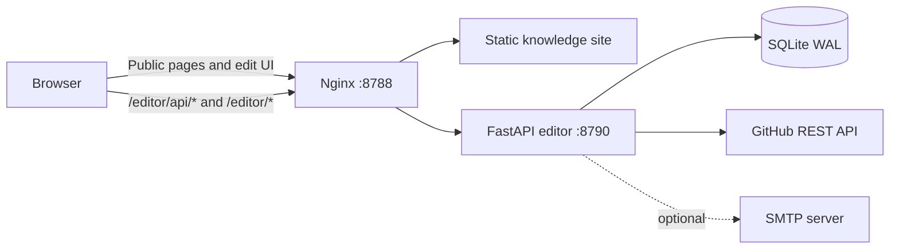

# Web Editing and Contribution Architecture

## Scope

The web editor adds authenticated content authoring without coupling content
storage to the static website repository.

- Reading remains public and static.
- The main reader exposes login, personal settings, and an authenticated edit mode.
- The full workspace remains available at `/editor/` for repository browsing,
  change review, and submission.
- Content changes target
  `Game-Client-Knowledge/Game-Client-Knowledge`.
- The editor never writes directly to `main`.
- One submission creates one branch, one commit, and one draft pull request.

## Identity Model

Email is the business identity and is unique. Each account also has a unique
username used in branch names and UI labels.

### Local account

A local account signs in with email or username and an Argon2-hashed password.
When it submits:

- The server GitHub Bot performs the API request.
- The commit author uses the account username.
- A verified account uses its email; an unverified account uses a site noreply
  address to prevent GitHub identity spoofing.
- The pull request body records the submitting account.

### GitHub account

GitHub OAuth supports two explicit operations:

- **Login:** resolve an existing immutable GitHub ID first, then a matching verified
  email, or create a new account.
- **Bind:** attach the authorized GitHub ID to the currently authenticated local
  account without changing its primary email.

The bind flow rejects identities already owned by another user and refuses to
replace a different existing binding. OAuth tokens are encrypted at rest and never
enter browser JavaScript. A local account can unlink GitHub only when it retains a
password login method.

Traditional GitHub OAuth App tokens are long-lived. The website login session is
separate and uses a configurable sliding idle timeout (30 days by default).
Expiring a website session does not remove the GitHub binding. If GitHub revokes
the token, **Refresh GitHub authorization** replaces it in place without unlinking
the account.

When a GitHub-authenticated session submits:

- The user's OAuth token performs the API request.
- No custom Git author is supplied.
- GitHub attributes the operation to the authenticated GitHub user.

The effective GitHub permission is still limited by that user's repository access.
A GitHub login does not grant write access to the organization repository.

## Edit Policy

Administrators can switch the active policy without restarting the service:

| Policy | Behavior |
|---|---|
| `local_authenticated` | Any active local or GitHub account can edit. |
| `github_verified` | Only administrators or accounts linked to a verified GitHub email can edit. |

Registration can be enabled or disabled independently. Existing accounts continue
to work when registration is disabled.

## Runtime Architecture



FastAPI listens only on `127.0.0.1:8790`. Nginx removes the `/editor/` prefix
before proxying. Cloudflare Tunnel continues to expose only Nginx.

## Server-Side Data

SQLite uses WAL mode and stores:

- Users and GitHub identity links.
- Hashed session tokens and CSRF tokens.
- One isolated draft set per user.
- Submission and pull request history.
- Administrator applications.
- Runtime settings.
- Notification delivery records.
- Audit events.
- Per-user first-login onboarding completion.

The database is outside all release directories:

```text
/var/lib/game-client-knowledge-editor/editor.db
```

Deploying or rolling back application code does not remove user drafts.

## Authentication

Local sessions use a random `HttpOnly`, `Secure`, `SameSite=Lax` cookie. Only a
SHA-256 digest of the session token is stored. State-changing requests also require
the session's CSRF token.

The reader and full workspace use the same server-persisted first-login guide.
See [First-login Onboarding](first-login-onboarding.md) for its content,
completion API, and migration behavior.

GitHub OAuth uses:

- A single-use, expiring `state`.
- A short-lived `HttpOnly` browser cookie bound to that `state`.
- A persisted purpose (`login` or `bind`), initiating user ID, and validated
  same-origin return path.
- PKCE challenge and verifier.
- A server-side code exchange.
- A verified GitHub email.
- Fernet encryption for the stored access token.

The bootstrap administrator is created only when the database contains no users.
Bootstrap credentials come from the server environment, and the account must
change its password before accessing the editor or administration page.

## Draft Workflow

Drafts are unique by `(user_id, path)`. Saving a draft never changes GitHub.

Allowed roots:

```text
knowledge/
interviews/
examples/
```

Knowledge and interview files must be Markdown. Source files under `examples/`
use an explicit text extension allowlist. Absolute paths, parent traversal, hidden
segments, control characters, unsupported extensions, non-UTF-8 files, and files
larger than 512 KiB are rejected.

Users can:

- Log in and manage their account from the reader header.
- Enable edit mode while staying on a rendered article.
- Load the current source file, edit it inline, preview it, and save a draft.
- Create a child module or file from module and topic context controls.
- Browse the complete repository as a collapsible directory tree in `/editor/`.
- Review all changed files separately from the repository tree.
- Preview sanitized Markdown.
- Mark an existing repository file for deletion (`D`).
- Discard an `A`, `M`, or `D` draft without changing GitHub.
- Save or delete a private draft.
- Submit all current drafts together.

Each user can keep at most 50 drafts.

## Editing Surfaces

### Reader edit mode

The static reader keeps rendered content as the default view. Once an authenticated
user presses the dedicated header edit button, the current document opens directly
in the inline editor and contextual controls become visible. The mode persists
across reader navigation, so each editable destination opens without a second
per-page click. The same header button exits edit mode; edit mode is not hidden
inside account settings.

- Document pages start loading `/raw/<sourceRelative>` from the document head in
  parallel with the editor bootstrap request. The deployed content commit and path
  form a `sessionStorage` cache key.
- The browser computes the source blob ID with
  `SHA1("blob " + byteLength + "\0" + content)`. This supplies `base_sha`
  without a GitHub Contents request.
- Source resolution order is personal draft, head prefetch, versioned session
  cache, deployed raw source, then `/repository/file` as a compatibility fallback.
- Markdown files open as literal source. A segmented `Markdown / Preview`
  control renders the complete current snapshot on demand without changing the
  stored source.
- Input writes the complete Markdown file directly into Current Tree. There is
  no WYSIWYG serialization step, so heading prefixes, tables, lists, code
  fences, and escaping remain exactly as typed.
- Source files continue to use a plain text editor.
- The workspace `Changes` pane opens full-file Diff first and can switch the
  selected file to editable Markdown without leaving that pane. The center
  reader expands to the full grid-row height instead of leaving unused space
  below a fixed-height editor.
- Module pages edit the module `README.md`.
- Module and topic controls prefill the correct content root and parent directory
  when creating child modules or files.
- Reader controls derive their parent from the currently displayed source,
  including an unmerged draft module, so nested files stay in that module.
- The full workspace can create a top-level module whose navigation metadata is
  stored in its own `README.md`; the website discovers it without Web code changes.
- Saving source that is byte-for-byte equal to the loaded baseline is a local no-op
  and does not create or update a draft. An unsaved new file still performs its
  required first save.

Saving updates only the user's server-side draft. It does not regenerate the
current static release and does not write to GitHub. The browser overlays saved
draft HTML on the static reader, so modified content appears immediately on reload.
New draft files are injected into module/topic navigation and open through a
same-page `?draft=<path>` preview until their pull request is merged and the static
site is rebuilt.

Draft status is consistent across reader navigation, module change lists, page
badges, and the full workspace: added files use green `A`, modified files use
yellow `M`, and deleted files use red `D`.

### Full workspace

`/editor/` has separate **Resources** and **Changes** views. Resources merge the
remote `main` tree and the user's draft paths into one hierarchical explorer.
Changes use Git-style `A`, `M`, and `D` markers instead of a second file tree.
Selecting a changed file opens a source-level line diff rather than rendered
Markdown: added lines are green, replacement lines are yellow, and removed lines
are red. The Resources view remains the editing surface and Markdown files there
use the same visual editor as the reader. The right panel remains the only
submission surface.

See [Dynamic Top-Level Content Modules](dynamic-content-modules.md) for discovery,
README frontmatter, online creation, and nested path resolution.

See [Reader Edit Modes and Line Diff](reader-edit-modes-and-diff.md) for the
admin-selectable `new`/`old` reader experience, preview-state revert, and local
red/yellow/green source comparison.

The workspace uses each repository-tree blob SHA as the expected version when
loading `/raw/<path>`. A matching client-computed SHA avoids a second GitHub request
and is cached for the session. Missing static files and SHA mismatches fall back to
`/repository/file`, so a deployed release cannot silently supply stale content for
an updated tree entry.

Deleting an existing file creates a `delete` draft with the file's current blob
SHA. Discarding that draft restores the `main` version. Deleting an unsubmitted new
file simply discards its `A` draft.

## Reader Bootstrap

Static pages start one `/editor/api/bootstrap` request from the document head. The
single response contains:

- Runtime integration configuration.
- Authenticated session summary and CSRF token.
- The current user's complete draft list.
- Sanitized HTML for the current page's active Markdown draft.

This replaces the previous serial `/config`, `/session`, `/drafts`, and `/preview`
waterfall. While the request is pending, the public static article remains fully
visible and the fixed-size account control shows a neutral synchronization
placeholder, preventing false logged-out state and header layout shifts.

OAuth state is retained until GitHub token exchange succeeds, allowing a callback
to be retried after a transient network failure. Explicit GitHub denial returns to
the initiating reader or workspace with an inline error instead of exposing a raw
API response.

## Submission Workflow

The branch format is:

```text
web/<username>/<custom-head>
```

For example:

```text
web/sourcecode/cpp-polymorphism
```

Submission performs these steps:

1. Receive the immutable Base Tree commit and the Current Tree's A/M/D files.
2. Check local submission ownership for overwrite authorization.
3. Ask for explicit overwrite confirmation only for the current user's branch.
4. Verify with one GitHub compare request that the Base commit belongs to
   `main` history, and read its tree SHA from the same response.
5. Create complete blobs only for upserted files; deletes use null tree entries.
6. Create a Git tree based on the historical Base tree.
7. Create a commit whose parent is the Base commit.
8. Create or force-update the temporary branch.
9. Reuse an open Draft PR for an overwritten branch, or create a new Draft PR.
10. Let GitHub calculate mergeability against the current `main`.
11. Record the result and notify every active administrator.

The request does not include unchanged files, Base file bodies, per-file Base
SHAs, line diffs, or patches. The server does not fetch the recursive `main`
tree and does not run a three-way merge. See
[Git Submission Protocol](git-submission-protocol.md).

New branches are created optimistically. A GitHub "ref already exists" response
becomes the structured branch conflict, avoiding a separate branch-ref GET on
the successful path.

If pull request creation fails after branch creation, the service attempts to remove
the temporary branch. A failed submission record can be retried with the same
custom head. See [Submission Head Conflicts](submission-head-conflicts.md) for
normalization, ownership checks, structured 409 responses, and overwrite behavior.

After submission, verified contributors receive a thank-you email. A background
task synchronizes open pull requests with GitHub and sends another email when a PR
is merged, closed, or automatically closed after the configured inactivity period.
Auto-closed PRs can be restored and urged from the contributor workspace. See
[Contributor Feedback and PR Lifecycle](contributor-feedback-and-pr-lifecycle.md).

## Administration

The administration page is server-protected and requires an authenticated,
password-ready administrator session.

Administrators can:

- Switch the edit policy.
- Enable or disable local registration.
- Configure QQ Mail, Gmail, Outlook, or custom SMTP from provider templates,
  retain the authorization code encrypted at rest, and send a test message to
  their own administrator email.
- Configure the PR inactivity threshold, inspect pending PRs, and trigger an
  immediate GitHub status synchronization.
- Approve or reject administrator applications.
- Confirm a local email after checking ownership through an external trusted
  channel.
- Inspect users, identity links, submissions, failures, and notifications.
- Open submitted pull requests.

Applications grant the `admin` role only after an existing administrator approves
them. Submission and application events target every active administrator email.
When SMTP is not configured, the notification is retained in the administration
page with status `unconfigured`.

## Security Boundaries

- Request body: 2 MiB maximum.
- Draft file: 512 KiB maximum.
- Draft count: 50 per user.
- Login and registration have in-process sliding-window limits.
- Markdown preview disables raw HTML and sanitizes rendered output.
- Repository paths are normalized and allowlisted server-side.
- Sessions and OAuth tokens are never exposed in browser storage.
- The service process has a read-only system view and can write only its database
  directory.
- `main` remains protected by GitHub review and branch rules.

The current rate limiter is process-local. Multiple API workers would require a
shared limiter such as Redis; production therefore runs one Uvicorn worker.

## Optional Integrations

The editor starts without GitHub OAuth or SMTP:

- Local login and Bot-attributed submissions remain available when the Bot token is
  configured.
- GitHub login is visibly disabled until OAuth credentials and an encryption key are
  present.
- Email delivery is marked `unconfigured`, while notifications remain visible to
  administrators.

The administration page reports each integration's configuration state.
