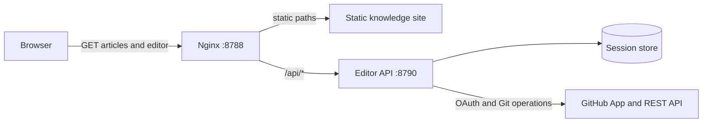
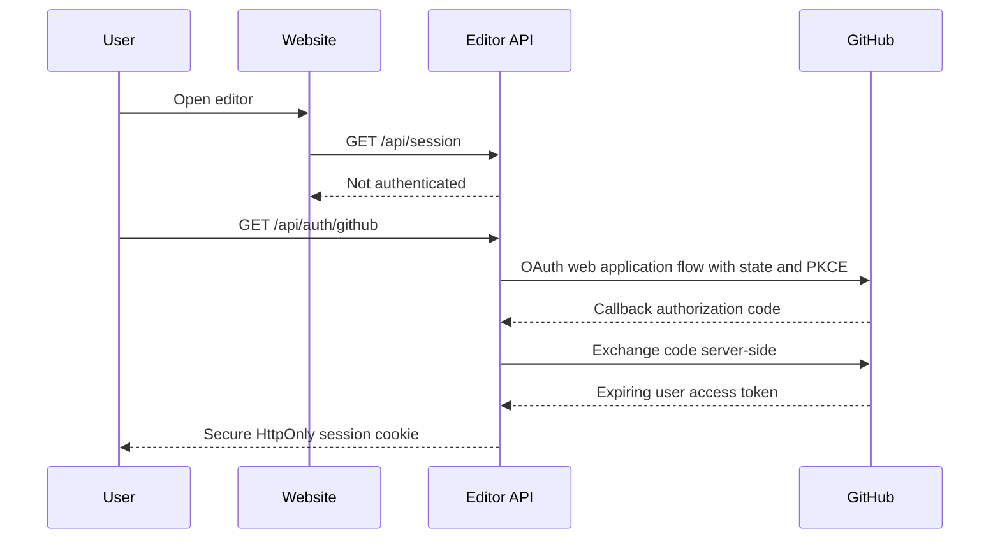

# Web Editing and GitHub Contribution Design

## Decision

The website can support authenticated editing, commits, and pull requests without
coupling website code to knowledge content.

The recommended first release is:

1. Keep reading public.
2. Require GitHub login for editing.
3. Allow edits only under `knowledge/`, `interviews/`, and `examples/`.
4. Create `web-edit/<login>/<timestamp>-<slug>` from the latest `main`.
5. Commit the submitted files to that branch.
6. Open a draft GitHub pull request.
7. Require repository checks and review before merge.

GitHub calls this a **pull request (PR)** rather than a merge request (MR).
The editor must never push directly to `main`.

## Identity modes

### User-attributed mode

A GitHub App user access token makes API requests on behalf of the authenticated
user. GitHub attributes those requests to that user, while audit logs record that a
GitHub App user-to-server token was used.

This mode has an important boundary: effective access is the intersection of:

- The GitHub App installation's repository access and permissions.
- The authenticated user's own repository access and permissions.

Therefore, a repository collaborator with write access can create a branch, commit,
and open a PR as themselves. A visitor without write access cannot gain write access
through login.

For commits created with the Git Database API, the author defaults to the
authenticated user when no explicit author is supplied. The backend should use this
default instead of accepting arbitrary author names or email addresses from the
browser.

### App-attributed mode

An installation access token can create an upstream branch and PR for a logged-in
visitor who does not have repository write access. In this mode:

- The GitHub App is the actor and PR creator.
- The authenticated user's login and immutable GitHub user ID are recorded in the
  PR body and the site's audit log.
- The UI must clearly say that the App submits on the user's behalf.
- Rate limits, abuse controls, and content validation are mandatory.

This is operationally simpler than creating and managing a fork for every visitor,
but it is not the same as a commit performed with that user's credentials.

### Fork mode

The strict public-contribution alternative is:

1. Create or reuse a fork under the user's account.
2. Create the temporary branch in that fork using the user's token.
3. Open a PR from `<user>:<branch>` to
   `Game-Client-Knowledge/Game-Client-Knowledge:main`.

This gives the clearest user ownership but introduces fork installation,
authorization, synchronization, and cleanup complexity. It should be a later phase,
not the MVP.

## Recommended policy

| User | Submission identity | Destination |
|---|---|---|
| Organization collaborator with write access | GitHub user | Temporary upstream branch and PR |
| Approved contributor without write access | GitHub App | Temporary upstream branch and draft PR |
| Unknown public user | Disabled initially | GitHub's normal fork workflow |

Start with collaborator-only user-attributed mode. Add App-attributed public
submissions after moderation, rate limiting, and audit visibility are operating.

## GitHub App configuration

Create one organization-owned GitHub App and install it only on
`Game-Client-Knowledge/Game-Client-Knowledge`.

Repository permissions:

| Permission | Access | Purpose |
|---|---|---|
| Metadata | Read | Repository identity and default branch |
| Contents | Write | Read files and create blobs, trees, commits, and branches |
| Pull requests | Write | Create draft PRs and read their status |

Configuration:

```text
Homepage URL:
https://knowledge.chenyurui.top

User authorization callback URL:
https://knowledge.chenyurui.top/api/auth/github/callback
```

Enable expiring user access tokens. Store the Client Secret and private key only on
the server. The Client ID may be exposed in the authorization URL, but there is no
reason to place it in the static bundle.

## Runtime architecture



The existing static site remains unchanged as the read path. A separate Node.js
service listens only on `127.0.0.1:8790`; Nginx proxies `/api/` to it. Cloudflare
Tunnel continues to expose only Nginx.

The editor UI can be a generated page at `/edit/`. It calls same-origin `/api/`
endpoints, so no cross-origin token or CORS design is required.

## Authentication flow



The GitHub token never enters browser JavaScript or local storage.

## Editing and submission flow

1. The browser requests a file and its base blob SHA.
2. The backend reads the file from the repository API.
3. The user edits Markdown and sees a local preview.
4. Submission includes path, base SHA, content, commit title, and PR description.
5. The backend rechecks the latest `main` and rejects stale edits with `409`.
6. The backend runs content validation and the repository audit.
7. The backend creates a temporary branch from the latest `main`.
8. It creates blobs and a tree, then one commit for all changed files.
9. It updates the temporary branch reference.
10. It opens a draft PR and returns the PR URL.

Use the Git Database API rather than one `Contents` API request per file so a
multi-file edit produces one atomic commit.

## Allowed operations

MVP:

- Create and edit Markdown.
- Create directories implicitly through file paths.
- Preview Markdown and Mermaid.
- Submit one atomic commit and draft PR.
- Show validation errors and GitHub conflicts.

Later:

- Upload images with MIME and size validation.
- Edit source examples.
- Rename or delete files.
- Fork-based public contributions.
- Review comments inside the website.

The first version should not support arbitrary binary uploads, workflow changes,
symlinks, Git submodules, or any path outside the three content roots.

## Security requirements

- Use OAuth `state` and PKCE and reject callback reuse.
- Store sessions in SQLite or Redis, not process memory.
- Use `Secure`, `HttpOnly`, `SameSite=Lax` cookies with short expiry.
- Encrypt refresh and access tokens at rest, or avoid persistence by requiring a new
  login after the short-lived token expires.
- Never return a GitHub token to the browser or write it to logs.
- Validate paths after normalization; reject `..`, absolute paths, hidden files,
  control characters, and unexpected extensions.
- Limit request size, file count, and Markdown size.
- Rate-limit login, preview, and submission endpoints per user and IP.
- Require the current file SHA to prevent overwriting concurrent edits.
- Run the existing Markdown and generated-site audits before creating a PR.
- Record GitHub user ID, login, branch, commit SHA, PR number, source IP hash, and
  timestamp in an append-only audit log.
- Protect `main` with required PR reviews and required status checks.
- Delete abandoned `web-edit/` branches with a scheduled cleanup job.

## Full-site login

It is possible to require login before reading any page by placing Cloudflare Access
in front of `knowledge.chenyurui.top`. That is separate from GitHub contribution
authorization and does not remove the need for the GitHub App.

For this public knowledge base, full-site login is not recommended because it
breaks public sharing, external links, and search indexing. Authentication should
protect `/edit/` and `/api/`, while reading stays public.

## Required administrator inputs

Implementation can begin after an organization owner creates and installs the
GitHub App and supplies these values through the server secret store:

```text
GITHUB_APP_ID
GITHUB_APP_CLIENT_ID
GITHUB_APP_CLIENT_SECRET
GITHUB_APP_PRIVATE_KEY
GITHUB_APP_INSTALLATION_ID
SESSION_ENCRYPTION_KEY
```

No value in this list should be committed to the website or content repository.

## Official references

- [Authenticating with a GitHub App on behalf of a user](https://docs.github.com/en/apps/creating-github-apps/authenticating-with-a-github-app/authenticating-with-a-github-app-on-behalf-of-a-user)
- [Generating a user access token for a GitHub App](https://docs.github.com/en/apps/creating-github-apps/authenticating-with-a-github-app/generating-a-user-access-token-for-a-github-app)
- [REST API endpoints for Git references](https://docs.github.com/en/rest/git/refs)
- [REST API endpoints for Git commits](https://docs.github.com/en/rest/git/commits)
- [REST API endpoints for pull requests](https://docs.github.com/en/rest/pulls/pulls#create-a-pull-request)
