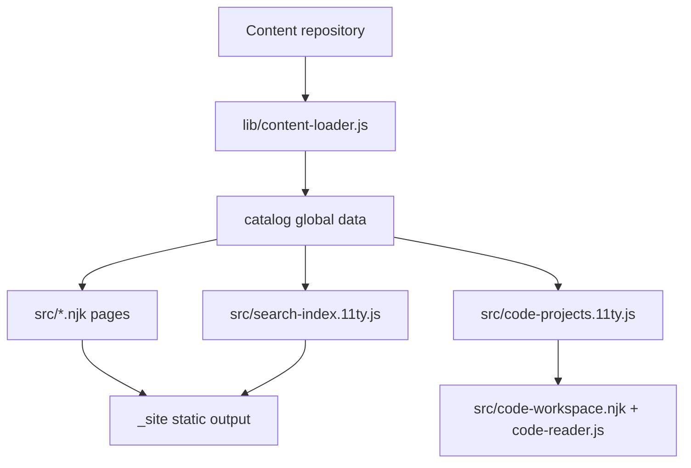
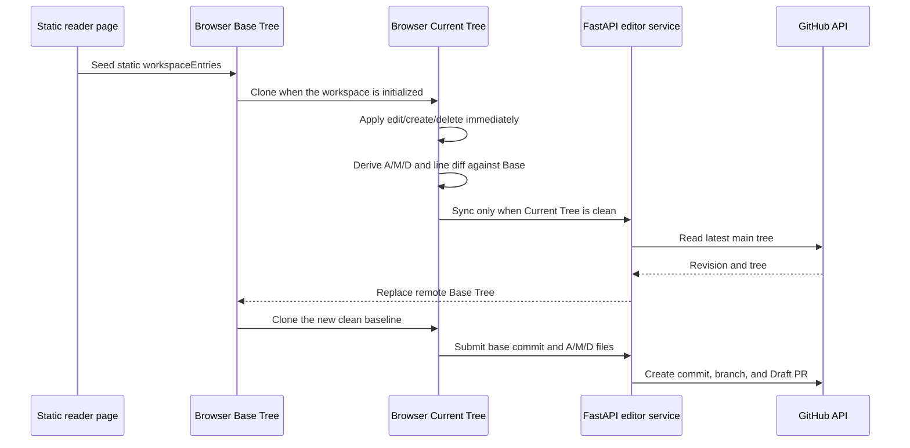

# Web Repository Architecture

This document maps the Web repository as it exists now: where each page lives,
how content becomes modules/topics/documents, and which runtime scripts add
search, editing, comments, and code-reading behavior.

## Repository Boundaries

```text
Game-Client-Knowledge/          content repository
Game-Client-Knowledge-Web/      website, editor service, build and deploy code
```

The content repository stores Markdown, source examples, project manifests, and
assets. The Web repository does not require content authors to edit website code.
The Web build scans the content repository and generates static pages.

## Main Build Flow



The central object is `catalog`, created by `loadCatalog()` in
`lib/content-loader.js` and registered as Eleventy global data in `.eleventy.js`.
Most templates read from this object instead of scanning the file system.

## Key Entrypoints

| File | Responsibility |
| --- | --- |
| `.eleventy.js` | Eleventy configuration, global data, Markdown rendering, filters, raw asset passthrough. |
| `lib/content-loader.js` | Scans the content repository and builds tracks, modules, topics, documents, redirects, workspace metadata, and search source data. |
| `lib/content-statistics.js` | Computes current text size and cached Git contribution statistics by track and contributor. |
| `lib/home-star-graph.js` | Builds the homepage contributor/document graph and its module, reference, and contribution edges. |
| `lib/code-project-loader.js` | Scans `program/code` projects with `code-project.json` and builds project-level source metadata. |
| `lib/mermaid-cache.js` | Creates and reads build-time Mermaid SVG cache keys. |
| `scripts/build-mermaid-cache.js` | Pre-renders Mermaid diagrams during the static build. |
| `scripts/audit-content.js` | Audits content repository structure, Markdown, links, and scanner inclusion. |
| `scripts/audit-site.js` | Audits generated `_site` HTML references and rendered Mermaid output. |

## Content Model

The current content structure is track-first:

```text
program/
  README.md
  knowledge/
  interviews/
  examples/
  code/

planning/
  README.md
  knowledge/
  interviews/
  written-tests/
  cases/
  templates/
```

The scanner interprets paths in four levels:

```text
track -> module -> topic -> document
```

Examples:

| Source path | Meaning |
| --- | --- |
| `program/README.md` | Program track landing page. |
| `program/knowledge/README.md` | Program knowledge module page. |
| `program/knowledge/cpp/README.md` | `C++` topic page. |
| `program/knowledge/cpp/01-cpp98.md` | Document inside the `C++` topic. |
| `program/knowledge/cpp/polymorphism/README.md` | Child topic under `C++`. |

`README.md` is the page for its owning track/module/topic. It is not shown as a
separate file row in topic file lists. Clicking the track/module/topic title opens
that README content.

## Generated Catalog Shape

`loadCatalog()` returns:

| Field | Meaning |
| --- | --- |
| `tracks` | Career tracks such as `program` and `planning`, each with its modules and counts. |
| `modules` | Content modules such as `program/knowledge` and `planning/cases`. |
| `units` | Topic directories that contain `README.md`, including parent/child relationships. |
| `documents` | Markdown and source documents rendered as individual pages. |
| `codeProjects` | Full code-reading projects discovered from `code-project.json`. |
| `sourceRoutes` | Map from source paths to generated website routes, used for Markdown link rewriting. |
| `legacyRedirects` | Redirect pages from old paths such as `/knowledge/...` to `/program/knowledge/...`. |
| `workspaceEntries` | Static metadata used by the browser-side editor tree. |
| `contribution` | Parsed `CONTRIBUTING.md` page data. |
| `repository` | Current content commit and update timestamp. |

## Route Rules

| Source | Route |
| --- | --- |
| `program/README.md` | `/program/` |
| `program/knowledge/README.md` | `/program/knowledge/` |
| `program/knowledge/cpp/README.md` | `/program/knowledge/cpp/` |
| `program/knowledge/cpp/01-cpp98.md` | `/program/knowledge/cpp/01-cpp98/` |
| `program/examples/cpp/demo/main.cpp` | `/program/examples/cpp/demo/files/main.cpp/` |
| `CONTRIBUTING.md` | `/contribute/` |
| Old `/knowledge/...` route | Static redirect to `/program/knowledge/...` |

The code-reading workspace is a global tool route:

```text
/code/workspace/?project=<project-id>
```

It is separate from the module page route `/program/code/`.

## Page Map

| Route / output | Template / source | Notes |
| --- | --- | --- |
| `/` | `src/index.njk` | Homepage. Shows track cards only. It does not expand modules inside tracks. |
| `/program/`, `/planning/` | `src/track-pages.njk` | Track landing pages. Shows modules inside the active track. |
| `/program/knowledge/`, `/planning/cases/`, etc. | `src/module-pages.njk` | Module pages. Shows all root topics for one module. |
| Topic/document pages | `src/content-pages.njk` | Reader pages for Markdown and source documents. |
| `/contribute/` | `src/contribute.njk` | Rendered contribution guide from `CONTRIBUTING.md`. |
| `/code/workspace/` | `src/code-workspace.njk` | Client-side IDE-like source reader. |
| `/search-index.json` | `src/search-index.11ty.js` | Search data consumed by `src/assets/js/search.js`. |
| `/code-projects/index.json` | `src/code-projects.11ty.js` | Code project metadata consumed by `src/assets/js/code-reader.js`. |
| Old route redirects | `src/legacy-redirects.njk` | One static redirect page per item in `catalog.legacyRedirects`. |
| `/404.html` | `src/404.njk` | Static not-found page. |

All pages use `src/_includes/layouts/base.njk` unless they are raw redirect or JSON
outputs.

## Layout and Navigation

`src/_includes/layouts/base.njk` owns:

- Header brand and primary navigation.
- Utility links: change overview, update guide, join page.
- Account dialog.
- Search dialog.
- Content creation dialog.
- Onboarding dialog.
- Global `window.GCK_CONFIG` used by client scripts.

Navigation has two modes:

1. On the homepage and non-track pages without `activeTrack`, the header shows
   tracks: `程序`, `策划`.
2. Inside a track, module, or document with `activeTrack`, the header shows modules
   for that active track only.

## Homepage

`src/index.njk` renders:

- The animated hero and repository statistics.
- Current content update time, character count, line count, and contributor count.
- A track/period contribution ledger with added, modified, and deleted lines.
- Track cards from `catalog.tracks`.
- No module bands and no topic cards in track mode.
- Contribution call-to-action.

This keeps the first-level information architecture clean: homepage chooses a
career track; track pages choose a module.

## Track Pages

`src/track-pages.njk` renders one page per item in `catalog.tracks`.

The track page layout remains module-card based:

- Header with track title and description.
- Optional Markdown body from `track/README.md`.
- Module card grid from `track.modules`.

This is where users see the modules inside a track.

## Module Pages

`src/module-pages.njk` renders one page per item in `catalog.modules`.

Important behavior:

- Root topics are listed directly.
- Child topic titles are visible by default.
- Child topic contents are collapsed by default.
- `README.md` is not rendered as a separate file row.
- Files are shown after child topics.
- Edit-mode buttons are attached to module/topic/file controls.

For a topic:

```text
Topic title                  visible
Child topic titles           visible
Child topic files            collapsed until child topic is opened
Direct files                 visible
README.md                    represented by title, not by a file row
```

## Reader Pages

`src/content-pages.njk` renders Markdown documents and source documents.

Desktop layout:

```text
left: module/topic navigation
center: article
right: H2/H3 page outline or topic context
```

Reader navigation follows the same hierarchy rule:

- Topic titles are visible.
- Files for the current topic are visible.
- Child topics are visible as titles.
- Child topic files are not shown until that child topic page is opened.
- Sidebar scroll position is preserved by `src/assets/js/site.js` using
  `sessionStorage`.

## Code Reading Workspace

The full source reader is independent from long-form document pages.

| File | Role |
| --- | --- |
| `lib/code-project-loader.js` | Finds `code-project.json`, validates project size and files, and emits metadata. |
| `src/code-projects.11ty.js` | Emits `/code-projects/index.json`. |
| `src/code-workspace.njk` | Static shell for the workspace. |
| `src/assets/js/code-reader.js` | Client-side project loader, file tree, tabs, search, outline, and source rendering. |
| `src/assets/js/code-worker.js` | Worker-side parsing/search support. |
| `scripts/code-reader-vendor-entry.js` | Bundles code reader dependencies. |

Projects are currently discovered under:

```text
program/code/**/code-project.json
```

The legacy `code/` root is still checked for compatibility.

## Search

Search is generated by `src/search-index.11ty.js`.

Each item contains:

```text
id, title, description, route, moduleKey, moduleSlug, trackKey, unitTitle, kind, text
```

`src/assets/js/search.js` lazy-loads `/search-index.json` when the search dialog
opens. It filters by `moduleKey` when a module-scoped search button is used and
labels document type with `moduleSlug`.

## Markdown Rendering

`.eleventy.js` configures Markdown rendering:

- `markdown-it` renders Markdown.
- Raw HTML is disabled.
- `markdown-it-anchor` adds anchors for H2 and H3.
- Prism highlights code.
- Mermaid fences use build-time cached SVG when available.
- Local Markdown links are rewritten through `catalog.sourceRoutes`.
- Existing non-page assets can be served through `/raw/<source-path>`.

The `raw/` tree is generated through Eleventy passthrough copy for content roots
and published code files.

## Client Runtime Scripts

| File | Responsibility |
| --- | --- |
| `src/assets/js/site.js` | Header/mobile nav, copy buttons, page TOC, reader sidebar state, comments loader. |
| `src/assets/js/site-visuals.js` | Background visual effects, pointer effects, ambient visuals. |
| `src/assets/js/home-star-illumination.js` | Pure illumination strategies and perceptual brightness mapping. |
| `src/assets/js/home-star-map.js` | Old/contribution homepage star maps, document motion, relation rendering, timed labels, and coverage. |
| `src/assets/js/home-intro-policy.js` | Home intro animation policy and device/session behavior. |
| `src/assets/js/home-statistics.js` | Client-side track and rolling seven-day contribution filters over static build data. |
| `src/assets/js/search.js` | Search dialog and weighted client-side search. |
| `src/assets/js/source-cache.js` | Browser-side raw source cache. |
| `src/assets/js/editor-integration.js` | Reader edit mode, local tree updates, create/delete controls, identity caching, and remote base synchronization. |
| `src/assets/js/workspace-store.js` | Persistent per-user Base Tree and Current Tree storage, replay, release, and derived A/M/D changes. |
| `src/assets/js/workspace-tree.js` | Builds module/topic navigation from the effective Current Tree. |
| `src/assets/js/editor-buffer.js` | Legacy local-buffer format used only for one-time migration into the dual-tree store. |
| `src/assets/js/markdown-preserve.js` | Markdown-preserving reader editor transformations. |
| `src/assets/js/reader-diff.js` | Reader-side line diff rendering. |
| `src/assets/js/reader-comments.js` | Source-anchored Markdown comments, deletion, incremental event polling, Agent request polling, and author highlighting. |
| `src/assets/js/code-reader.js` | IDE-style code workspace. |

## Editor Service

The editor is a FastAPI application under `editor/app/`.

| File | Responsibility |
| --- | --- |
| `editor/app/main.py` | API routes, authentication endpoints, repository synchronization, client-change submission, legacy draft migration endpoints, and admin endpoints. |
| `editor/app/config.py` | Environment-driven settings. |
| `editor/app/database.py` | SQLite schema, migrations, sessions, settings, drafts, submissions. |
| `editor/app/security.py` | Path validation, password hashing, CSRF/session helpers, branch name construction. |
| `editor/app/github.py` | GitHub API access for repository tree/files, commits, branches, PRs, OAuth. |
| `editor/app/comments.py` | Reader comments API. |
| `editor/app/comment_agent.py` | Durable Agent requests, bounded page/thread context, provider calls, and replies. |
| `editor/app/comment_agent_config.py` | Encrypted Agent API configuration and provider templates. |
| `editor/app/comment_markdown.py` | CommonMark rendering and comment-specific HTML sanitization. |
| `editor/app/pr_lifecycle.py` | PR sync, timeout, restore/urge URLs. |
| `editor/app/site_updates.py` | Admin-triggered site update request/status helpers. |
| `editor/app/mailer.py`, `notifications.py`, `smtp_config.py` | Email delivery and SMTP configuration. |

Static editor/admin pages live under `editor/app/static/`.

## Online Editing Data Flow



The Base Tree is immutable during normal editing. Only remote synchronization may
replace it. The Current Tree drives reader navigation, resource management, and
the change overview. Editing, creation, and deletion update the Current Tree in
the same animation frame, so the change count and line diff do not wait for a
server round trip.

The server does not persist new editing state. SQLite draft rows and
`editor-buffer.js` payloads remain readable only to migrate existing users once.
After migration, the client deletes legacy server drafts. A submission sends the
Base commit plus the derived local A/M/D set directly to `/api/submit`. The
server creates a commit from that historical Base tree. GitHub evaluates the
branch against current `main` and exposes merge conflicts in the pull request.

The standalone workspace exposes two explicit operations:

- **Sync remote** replaces Base Tree only when Current Tree has no local changes.
- **Release cache** resets the Current Tree to the Base Tree and removes all
  local unsubmitted changes.

## Build Scripts

| Script | Purpose |
| --- | --- |
| `npm run build:vendor` | Bundle static browser vendors into `.cache/vendor`. |
| `npm run build:mermaid` | Pre-render Mermaid diagrams into the cache. |
| `npm run build` | Build vendor assets, Mermaid cache, clean `_site`, then run Eleventy. |
| `npm run test:content-statistics` | Verify Git line accounting, contributor aliases, track splits, and cache reuse. |
| `npm run test:home-star-graph` | Verify star membership, smallest-directory strong links, Markdown references, and contribution links. |
| `npm run audit` | Run content audit before publishing. |
| `npm run audit:site` | Audit generated site HTML after build. |
| `npm run check` | Run tests, audits, build, and generated-site audit. |

The production updater expects pushed immutable commits. It should not publish a
local unpushed worktree.

Content contribution history is computed during the immutable build, never on a
reader request. The cache is keyed by the full content commit. Production keeps
it at `/home/sourcecode/gck-builder/content-statistics-v4.json`; an unchanged
commit is a direct cache hit, while a descendant commit scans only the new Git
range. The browser receives compact static events and calculates the rolling
seven-day window locally.

## Deployment and Operations Files

| File | Purpose |
| --- | --- |
| `scripts/deploy-server.sh` | Server deployment helper. |
| `scripts/deploy-editor.sh` | Editor service deployment helper. |
| `scripts/install-update-control.sh` | Installs/updates server-side update controls. |
| `scripts/require-pushed-commits.sh` | Ensures deploy inputs are pushed commits. |
| `docs/site-update-control.md` | Details of automatic/manual update control. |
| `docs/editor-operations.md` | Editor deployment and operation notes. |
| `docs/operations.md` | Build and deployment workflow. |

## Common Change Points

| Task | Usually edit |
| --- | --- |
| Change homepage layout | `src/index.njk`, `src/assets/css/site.css`, visual checks. |
| Change homepage star graph | `lib/home-star-graph.js`, `src/assets/js/home-star-map.js`, `editor/app/comments.py`, `docs/home-contribution-star-map.md`. |
| Change contribution metrics | `lib/content-statistics.js`, `src/assets/js/home-statistics.js`, `src/index.njk`. |
| Change track/module navigation | `src/_includes/layouts/base.njk`, `src/track-pages.njk`, `src/index.njk`. |
| Change content hierarchy rules | `lib/content-loader.js`, `src/module-pages.njk`, `src/content-pages.njk`, `src/assets/js/workspace-tree.js`, `src/assets/js/editor-integration.js`. |
| Change search behavior | `src/search-index.11ty.js`, `src/assets/js/search.js`. |
| Change reader page behavior | `src/content-pages.njk`, `src/assets/js/site.js`, `src/assets/css/site.css`. |
| Change editor/API behavior | `editor/app/main.py`, `editor/app/security.py`, `editor/app/github.py`. |
| Change local workspace semantics | `src/assets/js/workspace-store.js`, `src/assets/js/editor-integration.js`, `editor/app/static/editor.js`. |
| Change code workspace | `lib/code-project-loader.js`, `src/code-workspace.njk`, `src/assets/js/code-reader.js`. |
| Change audits | `scripts/audit-content.js`, `scripts/audit-site.js`. |

## Verification Checklist

For changes that affect generated pages:

```bash
source ~/.nvm/nvm.sh
nvm use 20.20.2
CONTENT_REPO_PATH=/Users/bytedance/Desktop/ECS/Game-Client-Knowledge npm run build
CONTENT_REPO_PATH=/Users/bytedance/Desktop/ECS/Game-Client-Knowledge npm run audit:site
```

For content-scanner changes, also run:

```bash
CONTENT_REPO_PATH=/Users/bytedance/Desktop/ECS/Game-Client-Knowledge npm run test:content-loader
CONTENT_REPO_PATH=/Users/bytedance/Desktop/ECS/Game-Client-Knowledge npm run audit
```

For reader/editor client changes, at minimum run:

```bash
node --check src/assets/js/site.js
node --check src/assets/js/editor-integration.js
npm run test:workspace-store
npm run test:markdown-preserve
```

Use `scripts/visual-check.js` for layout-sensitive changes.
